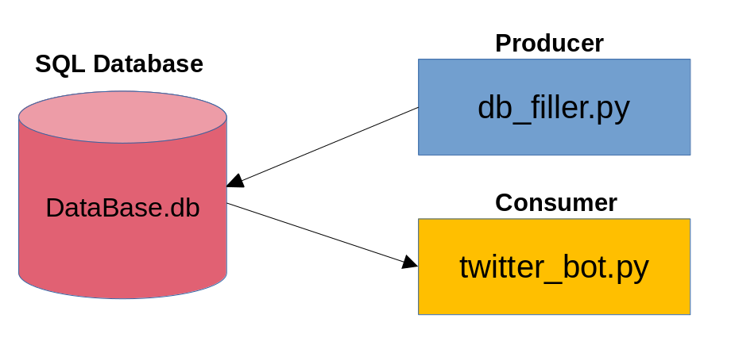

## General description

In Paraguay, the institution responsible for managing government procurement is the DNCP. On their website (https://www.contrataciones.gov.py/), they provide all the necessary information for the private sector to participate in tenders. For those familiar with the Paraguayan procurement process, this website contains everything they need to inform themselves about the tenders. However, there is a lack of general interest and knowledge among the public on how to navigate the website to obtain relevant information on where and how the money is being used.

This generates a need to raise awareness on how the government is spending its budget. One of the main reasons for this is the rampant corruption between the private sector and the public sector.

This bot aims to use social media to present the complexities of public bidding in an easily understandable manner to the average citizen through a widely used medium like Twitter.

Designed in Python and being open-source, the idea is to allow all interested parties to use the code to generate awareness on the spending of the government. The architecture of the code allows for easy scalability, particularly in expanding to other types of social media platforms, such as Telegram.

## Dependencies

- Pandas
- Requests 
- bs4
- Tweepy
- SQlite

## Architecture

The architecture is very straight forward, it is a producer-consumer one. The producer is db_filler.py and the consumer twitter_bot.py.

The producer manages one SQL database that contains two tables (for now). One table is used to fill the information on the tenders that were just updated to "ADJ". And the second one does the same but for tenders that were updated to "CONV".

To detect which tenders updated there status, we use a .csv file generated automatically by the DNCP. 

## Folder structure

### credentials

 There are two files, dncp.json and twitter.json. You need to put your credentials there. To obtain the dncp credentials go to https://www.contrataciones.gov.py/datos/adm/login and for twitter go to https://developer.twitter.com/en

### src

* db_filler.py: used to check the .csv generated by the DNCP to detect which tenders changed there status, fills the database with relevant information using the API provided by the DNCP.

* twitter_bot.py: used to tweet which tenders changed there status, it reads the database filled by db_filler.py and uses the twitter API to tweet. 

* reporte.csv: used to detect tender status changed to "ADJ".

* reporteCONV.csv: used to detect tender status changed to "CONV".

### src/modules

 * bot_api.py: API to interact with twitter.
 * dncp_api.py: API to interact with www.contrataciones.gov.py
 * sqlite_api.py: API to interact with a sqlite database.

## TODO

- Obtain contractors using DNCP's API V3.
- Generate python documentation.
- Improve db_filler.py coupling from twitter_bot.py.
- Add to licitaciones class a method to obtain the items requested and bought.